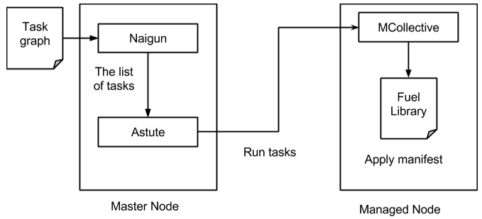
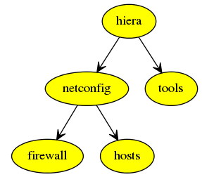
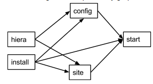
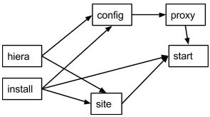

Modular Architecture
====================

The idea behind the modular architecture introduced in Fuel 6.1 is the separation of the legacy site.pp manifests to a group of small manifests. Each manifest can be designed to do only a limited part of the deployment process. These manifests can be applied by Puppet the same way as it was done in Fuel 6.0 or older. The deployment process in Fuel 6.1 consists of a sequential application of small manifests in a predefined order.

Using smaller manifests instead of the monolithic ones has the following advantages:

* **Independent development**
  As a developer, you can work only with those Fuel components that you are interested in. A separate manifest
  can be dedicated wholly to a single task without any interference from other components and developers. This
  task may require the system to be in some state before the deployment can be started and the task may require
  some input data be available. But other than that each task is on its own.

* **Granular testing**
  With granular deployment introduced in Fuel 6.1, any finished task can be tested independently. Testing can be
  automated with autotests; you can snapshot and revert the environment to a previous state; or you can manually
  run tests in your environment. With Fuel 6.0 or older, testing consumes a considerable amount of time as there
  is no way to test only a part of the deployment -- each new change requires the whole deployment to be started
  from scratch. See also the `granular deployment blueprint <https://blueprints.launchpad.net/fuel/+spec/granular-deployment-based-on-tasks>`_.

* **Encapsulation**
  Puppet deems all resources to be unique within the catalog and the way it works with dependencies and
  ordering. Normally one cannot take a third party module and expect that it will work as designed within the
  Puppet infrastructure. Modular manifests, introduced in Fuel 6.1, solve this by making every single task use
  its own catalog without directly interfering with other tasks.

* **Self-Testing**
  Granular architecture allows making tests for every task. These tests can be run either after the task to
  check if it is successful or before the task to check if the system is in the required state to start the
  task. These tests can be used by the developer as acceptance tests, by the Continuous Integration (CI) to
  determine if the changes can be merged, or during the real deployment to control the whole process and to
  raise alarm if something goes wrong.

* **Using multiple tools**
  Sometimes you may use a tool other than Puppet (from shell scripts to Python or Ruby, and even binary
  executables). Granular deployment allows using any tools you see fit for the task. Tasks, tests and pre/post
  hooks can be implemented using anything the developer knows best. In Fuel 6.1 only pre/post hooks can use
  non-Puppet tasks.

Granular deployment process
---------------------------

Granular deployment is implemented using the Nailgun plugin system. Nailgun uses the deployment graph data to determine what tasks on which nodes should be run. This data graph is traversed and sent to Astute as an ordered list of tasks to be executed with the information on which nodes they should be run.

Astute receives this data structure and starts running the tasks one by one in the following order:

 #. Pre-deploy actions
 #. Main deployment tasks
 #. Post-deploy actions

Each tasks reports back if it is successful. Astute stops the deployment on any failed task.

See also `Fuel Reference Architecture: Task Deployment <https://docs.mirantis.com/openstack/fuel/fuel-6.1/reference-architecture.html#task-deployment>_`.

Task Graph
----------

A task graph is built by Nailgun from *tasks.yaml* files during Fuel Master node bootstrap:

 ::

   fuel rel --sync-deployment-tasks --dir /etc/puppet/

*tasks.yaml* files describe a group of tasks (or a single task).

 ::

   - id: netconfig
     type: puppet
     groups: [primary-controller, controller, cinder, compute, ceph-osd, zabbix-server, primary-mongo, mongo]
     required_for: [deploy]
     requires: [hiera]
     parameters:
      puppet_manifest: /etc/puppet/modules/osnailyfacter/modular/netconfig.pp
      puppet_modules: /etc/puppet/modules
      timeout: 3600

where:

 * ``id`` - Each task must have the unique ID.
 * ``type`` - Determines how the tasks should be executed. Currently there are Puppet and exec types.
 * ``groups`` - Groups are used to determine on which nodes these tasks should be started and are mostly related to the node roles.
 * ``required_for`` - The list of tasks that require this task to start. Can be empty.
 * ``requires`` - The list of tasks that are required by this task to start. Can be empty.
 * Both the ``requires`` and ``required_for`` fields are used to build the dependency graph and to determine the order of task execution.
 * ``parameters`` - The actual payload of the task. For the Puppet task these can be paths to modules (puppet_modules) and the manifest (puppet_manifest) to apply; the exec type requires the actual command to run. 
 * ``timeout`` determines how long the orchestrator should wait (in seconds) for the task to complete before marking it as failed.

Graph example
-------------

 ::

   - id: netconfig
     type: puppet
     groups: [primary-controller, controller, cinder, compute, ceph-osd, zabbix-server, primary-mongo, mongo]
     required_for: [deploy_start]
     requires: [hiera]
     parameters:
      puppet_manifest: /etc/puppet/modules/osnailyfacter/modular/netconfig.pp
      puppet_modules: /etc/puppet/modules
      timeout: 3600

 ::

   - id: tools
     type: puppet
     groups: [primary-controller, controller, cinder, compute, ceph-osd, zabbix-server, primary-mongo, mongo]
     required_for: [deploy_start]
     requires: [hiera]
     parameters:
      puppet_manifest: /etc/puppet/modules/osnailyfacter/modular/tools.pp
      puppet_modules: /etc/puppet/modules
      timeout: 3600

  - id: hosts
    type: puppet
    groups: [primary-controller, controller, cinder, compute, ceph-osd, zabbix-server, primary-mongo, mongo]
    required_for: [deploy_start]
    requires: [netconfig]
    parameters:
     puppet_manifest: /etc/puppet/modules/osnailyfacter/modular/hosts.pp
     puppet_modules: /etc/puppet/modules
     timeout: 3600

  - id: firewall
    type: puppet
    groups: [primary-controller, controller, cinder, compute, ceph-osd, zabbix-server, primary-mongo, mongo]
    required_for: [deploy_start]
    requires: [netconfig]
    parameters:
     puppet_manifest: /etc/puppet/modules/osnailyfacter/modular/firewall.pp
     puppet_modules: /etc/puppet/modules
     timeout: 3600

  - id: hiera
    type: puppet
    groups: [primary-controller, controller, cinder, compute, ceph-osd, zabbix-server, primary-mongo, mongo]
    required_for: [deploy_start]
    parameters:
     puppet_manifest: /etc/puppet/modules/osnailyfacter/modular/hiera.pp
     puppet_modules: /etc/puppet/modules
     timeout: 3600

This graph data will be processed to the following graph when imported to the Nailgun. Deploy task is an anchor used to start the graph traversal and is hidden from the image.

Nailgun will run the hiera task first, then netconfig or tools, and then firewall or hosts. Astute will start each task on those nodes whose roles are present in the groups field of each task.

Modular manifests
-----------------

 Starting with Fuel 6.1, granular deployment allows using a number of small manifests instead of the single monolithic one. These small manifests are placed in the ``deployment/puppet/osnailyfacter/modular`` folder and its subfolders. In Fuel 6.0 or older there was a single entry point manifest used -- located at ``deployment/puppet/osnailyfacter/examples/site.pp`` in the `fuel-library <https://github.com/openstack/fuel-library/>`_ repository.

To write a modular manifest, you will need to take all the resources, classes and definitions you are using to deploy your component and place them into a single file. This manifest should be able to do everything that is required for your component.

The system should be in some state before you will be able to start your task. For example, database, Pacemaker, or Keystone should be present.

You should also satisfy the missing dependencies. Some of the manifests may have internal dependencies on other manifests and their parts. You will have to either remove these dependencies or make dummy classes to satisfy them.

Modular example
---------------

Here is an example of a modular manifest that installs Apache and creates a basic site.

 ::

   >>> site.pp

   $fuel_settings = parseyaml($astute_settings_yaml)

   File {
     owner => ‘root’,
     group => ‘root’,
     mode  => ‘0644’,
   }

   package { ‘apache’ :
     ensure => ‘installed’,
   }

   service { ‘apache’ :
     ensure => ‘running’,
     enable => ‘true’,
   }

   file { ‘/etc/apache.conf’ :
     ensure  => present,
     content => template(‘apache/config.erb’),
   }

   $www_root = $fuel_settings[‘www_root’]

   file { “${www_root}/index.html” :
     ensure => present,
     content => ‘hello world’,
   }

As the first line of any granular Puppet manifest, add the following:

 ::

   notice("MODULAR: $$$TASK_ID_OR_NAME$$$")

It will help you debug by finding a place in ``puppet.log`` where your task started.

Now let's split the manifest into several tasks:

 ::

   >>> apache_install.pp
   package { ‘apache’ :
     ensure => ‘installed’,
   }

   >>> apache_config.pp
   File {
    owner => ‘root’,
    group => ‘root’,
    mode  => ‘0644’,
   }

   $www_root = hiera(‘www_root’)

   file { ‘/etc/apache.conf’ :
    ensure  => present,
    content => template(‘apache/config.erb’),
   }

   >>> create_site.pp
   File {
     owner => ‘root’,
     group => ‘root’,
     mode  => ‘0644’,
   }

   $www_root = hiera(‘www_root’)

   file { “${www_root}/index.html” :
     ensure => present,
     content => ‘hello world’,
   }

   >>> apache_start.pp
   service { ‘apache’ :
     ensure => ‘running’,
     enable => ‘true’,
   }

We have just created several manifests. Each will do just its simple action. First we install an Apache package, then we create a configuration file, then create a sample site, and, finally, start the service. Each of these tasks now can be started separately together with any other task. We have also replaced ``$fuel_settings`` with hiera calls.

Since there are some dependencies, we cannot start the Apache service without installing the package first, but we can start the service just after the package installation without the configuration and sample site creation.

So there are the following tasks:

 * install
 * config
 * site
 * start
 * hiera (to enable the hiera function)

A visual representation of the dependency graph will be the following:

**start**, **config**, and **site** require the package to be installed. **site** and **config** require the **hiera** function to work. Apache should be configured and **site** should be created to start.

Now, let’s write a data yaml to describe this structure:

 ::

   - id: hiera
     type: puppet
     role: [test]
     required_for: [deploy]
     parameters:
       puppet_manifest: /etc/puppet/modules/osnailyfacter/modular/hiera.pp
       puppet_modules: /etc/puppet/modules
       timeout: 3600

   - id: install
     type: puppet
     role: [test]
     required_for: [deploy]
     parameters:
       puppet_manifest: /etc/puppet/modules/osnailyfacter/modular/apache_install.pp
       puppet_modules: /etc/puppet/modules
       timeout: 3600

   - id: config
     type: puppet
     role: [test]
     required_for: [deploy]
     requires: [hiera, install]
     parameters:
       puppet_manifest: /etc/puppet/modules/osnailyfacter/modular/apache_config.pp
       puppet_modules: /etc/puppet/modules
       timeout: 3600

   - id: site
     type: puppet
     role: [test]
     required_for: [deploy]
     requires: [install, hiera]
     parameters:
       puppet_manifest: /etc/puppet/modules/osnailyfacter/modular/create_site.pp
       puppet_modules: /etc/puppet/modules
       timeout: 3600

   - id: start
     type: puppet
     role: [test]
     required_for: [deploy]
     requires: [install, config, site]
     parameters:
       puppet_manifest: /etc/puppet/modules/osnailyfacter/modular/apache_start.pp
       puppet_modules: /etc/puppet/modules
       timeout: 3600

Nailgun can process this data file and tell Astute to deploy all the tasks in the required order. Other nodes or other deployment modes may require more tasks or tasks run in different order.

Now, let's say you have a new apache_proxy class, and want to add it to the setup:

 ::

   >>> apache_proxy/init.pp

   file { ‘/etc/apache.conf’ :
     owner   => ‘root’,
     group   => ‘root’,
     mode    => ‘0644’,
     ensure  => present,
    source  => puppet:///apache/proxy.conf,
   } ->

   service { ‘apache’ :
     ensure => running,
     enable => true,
  }

This tasks updates the main Apache configuration as well, and it conflicts with the previous configuration tasks. It would not be possible to combine them in a single catalog. It also attempts to enable the Apache service, which produces a new duplicate error.

Granular deployment solves this. You can still use them together without trying to do something with duplicates or dependency problems.

We have just inserted a new proxy task between the **config** and **start** tasks. The proxy task will rewrite the configuration file created in the **config** task making the **config** task pointless. This setup will still work as expected and we will have a working Apache-based proxy. Apache will be started on the proxy task but the **start** task will not produce any errors due to Puppet's idempotency.

There are also `granular noop tests <https://ci.fuel-infra.org/job/fuellib_noop_tests/>`_ based on rspec-puppet. These CI tests will put -1 for any new Puppet task not covered with tests.

Testing
-------

Testing these manifests is easier than having a single monolithic manifest.

After writing each file you can manually apply it to check if the task works as expected.

If the task is complex enough, it can benefit from automated acceptance testing. These tests can be implemented using any tool you as a developer see fit.

For example, let’s try using `http://serverspec.org <http://serverspec.org>`_. This is an rspec extension that is very convenient for server testing.

The only thing the install task does is the package installation and it has no preconditions. The spec file for it may look like this:

 ::

   require 'spec_helper'
   describe package(‘apache’) do
     it { should be_installed }
   end

Running the spec should produce an output similar to the following:

 ::

   Package "nginx"
     should be installed

   Finished in 0.17428 seconds
   1 example, 0 failures

There are many different resource types *serverspec* can work with, and this can easily be extended. Other tasks can be tested with specs like the following:

 ::

   describe service('apache') do
     it { should be_enabled }
     it { should be_running }
   end

   describe file(‘/etc/apache.conf’) do
     it { should be_file }
     its(:content) { should match %r{DocumentRoot /var/www/html} }
   end
