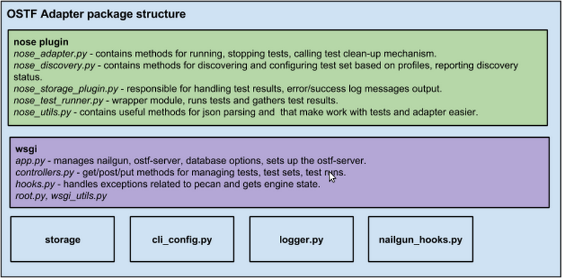

.. _ostf-adapter:

OSTF Adapter
============

.. _ostf-adapter-architecture:

Architecture
^^^^^^^^^^^^

The important thing to remember about OSTF Adapter
is that (just like when writing tests) all code should follow
`pep8 <https://www.python.org/dev/peps/pep-0008/>`_) standard.

.. _ostf-dev-env:

Preparing an environment for development
^^^^^^^^^^^^^^^^^^^^^^^^^^^^^^^^^^^^^^^^

.. warning:: Nailgun requires Python 2.6 with development files.
    Please, check the installed Python version using ``python --version`` command.
    If the versions do not match, install Python 2.6 as described in step 1.
    If Python versions match, skip step 1.

#. Install Python 2.6 using
   `PPA <https://launchpad.net/~fkrull/+archive/ubuntu/deadsnakes>`_::

     sudo add-apt-repository ppa:fkrull/deadsnakes
     sudo apt-get update
     sudo apt-get install python2.6 python2.6-dev

#. Install and configure PostgreSQL database::

    sudo apt-get install postgresql postgresql-server-dev-9.1
    sudo -u postgres createuser -SDRP ostf  # enter password "ostf"
    sudo -u postgres createdb ostf

#. Install pip::

    sudo apt-get install python-pip

#. Install virtualenv. This step increases flexibility
   when dealing with environment settings and package installation.
   This step is obligatory if you need to downgrade to Python version 2.6
   (that OSTF depends on)::

    sudo pip install virtualenv virtualenvwrapper
    source /usr/local/bin/virtualenvwrapper.sh  # you can save this to .bashrc
    whereis python2.6 # Prints the install path of python 2.6, let's say /usr/bin/python2.6.
                      # Copy the output and paste it in the command below for option -p
    mkvirtualenv fuel-ostf -p /usr/bin/python2.6  # you can use any name instead of 'fuel-ostf'
    workon fuel-ostf  # command selects the particular environment
    python --version # verify that default Python version inside virtual environment is 2.6

#. Install Tox package::

    workon fuel-ostf
    pip install tox

.. _ostf-adapter-tests:

Running Adapter's Tests
^^^^^^^^^^^^^^^^^^^^^^^

Adapters's tests can be run using `run_test.sh` script.
To learn about available options, enter `  ./run_test.sh -h` command.
To run selected tests, use `./run_test.sh -t <path/to/selected_tests.py>`.

