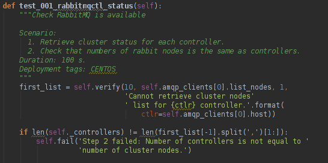

.. _ostf-health:

OSTF checks (fuel_health)
=========================

Package architecture
^^^^^^^^^^^^^^^^^^^^

The `fuel_health` package has the following main modules:

#. **config** module - responsible for getting data necessary for the tests.
   All data is gathered from Nailgun component or a text config.
   Nailgun provides the following data:

   * OpenStack admin user name
   * OpenStack admin user password
   * OpenStack admin user tenant
   * IP addresses of Controller nodes
   * IP addresses of Compute nodes - easily get data from Nailgun by parsing role key in response json file
   * deployment mode (HA /non-HA)
   * deployment operating system (Red Hat Enterprise Linux/CentOS)
   * Keystone / Horizon URLs
   * tiny proxy address

   All other information we need is stored in `config.py` file itself
   and remains default in this case.
   If you are using data from Nailgun
   (OpenStack installation using Fuel), you should initialize `NailgunConfig()` class.
   Nailgun runs on the Fuel Master node, so you can easily get data for each cluster by
   invoking `http:/localhost:8000/api/<uri>` curl.
   Cluster id can be get from OpenStack environment (provided by Fuel).
   If you want run OSTF for non-Fuel installation,
   change the initialization of `NailgunConfig()` to `FileConfig()` and set
   parameters marked with green color in config. For more details,
   see :ref:`Appendix 1<appendix1>` (default config file path is `fuel_health/etc/test.conf`)

#. **cleanup.py**  -  invoked by OSTF adapter if user stops
    test execution in the Fuel web UI.
    This module is responsible for deleting all test resources
    created during test suite run.
    It simply finds all resources whose names start with ‘ost1_test-’
    and destroys each of them using `_delete_it` method.

    .. note:: If you decided to add extra
      cleanup for this resource, you should note the following:
      all resources depend on each other. That is why deleting a resource that is
      still in use will give you an exception. Please, do not forget that deleting several
      resources requires an ID for each resource, but not its name.
      You will need to specify `delete_type` optional argument in `_delete_it` method to `‘id’*`.

#. **nmanager.py** - contains base classes for tests.
    Each base class includes setup,
    teardown and methods that
    act as an interlayer between tests and OpenStack python clients (see nmanager architecture diagram).

   .. image:: ../_images/nmanager.png

#. **fuel_health/common/test_mixins.py** - provides mixins
   to pack response verification into a
   human-readable message. For assertion failure cases,
   the method requires a step on which user fails and a descriptive
   message should be provided.
   The `verify()` method also requires a timeout value to be set.
   It should be used when checking OpenStack operations (such as instance creation).
   Sometimes a cluster operation takes too long and may be a sign of a problem, so this will
   secure the tests from such a situation or even from going into an infinite loop.

#. **fuel_health/common/ssh.py** - provides an easy way to ssh to nodes or instances.
   This module uses the `paramiko library <http://www.paramiko.org>`_
   and contains some useful wrappers that make some routine tasks for you
   (such as ssh key authentication, starting transport threads, etc).
   Also, it contains a rather useful `exec_command_on_vm()` method,
   which makes an ssh to an instance through a Controller and then executes
   the necessary command on it.

Main rules of code contributions
^^^^^^^^^^^^^^^^^^^^^^^^^^^^^^^^

There are a few rules you need to follow to successfully pass the code review and contribute
a high-quality code.

How to setup my environment?
^^^^^^^^^^^^^^^^^^^^^^^^^^^^

OSTF repository is located on Stackforge: https://github.com/stackforge/fuel-ostf. You also have to install and hook-up gerrit, because otherwise you will not be able to contribute code. To do that you need to follow registration and installation instructions in the document https://wiki.openstack.org/wiki/CLA#Contributors_License_Agreement
After you've completed the instructions, you're all set to begin editing/creating code.

How should my modules look like?
^^^^^^^^^^^^^^^^^^^^^^^^^^^^^^^^

The rules are quite simple:
  - follow Python coding rules
  - follow OpenStack contributor's rules
  - watch out for mistakes in docstrings
  - follow correct test structure
  - always execute your tests after you wrote them before sending them to review

Speaking of following Python coding standards, you can find the style guide here: http://www.python.org/dev/peps/pep-0008/. You should read it carefully once and after implementing scripts you need to run some checks that will ensure that your code corresponds the standards. Without correcting issues with coding stadards your scripts will not be merged to master.

You should always follow the following implementation rules:
  - name the test module, test class and test method beginning with the word "test"
  - if you have some tests that should be ran in a specific order, add a number to test method name, for example: test_001_create_keypair
  - use verify(), verify_response_body_content() and other methods from mixins (see OSTF package architecture fuel_health/common/test_mixins.py section) with giving them failed step parameter
  - always list all steps you are checking using test_mixins methods in the docstring in Scenario section in correct order
  - always use verify() method when you want to check an operation that can go to an infinite loop

The test docstrings are another important piece and you should always stick to the following docstring structure:
  - test title - test description that will be always shown on UI (the remaining part of docstring will only be shown in cases when test failed)
  - target component (optional) - component name that is tested (e.g. Nova, Keystone)
  - blank line
  - test scenario, example::

       Scenario:
          1. Create a new small-size volume.
          2. Wait for volume status to become "available".
          3. Check volume has correct name.
          4. Create new instance.
          5. Wait for "Active" status.
          6. Attach volume to an instance.
          7. Check volume status is "in use".
          8. Get information on the created volume by its id.
          9. Detach volume from the instance.
          10. Check volume has "available" status.
          11. Delete volume.

  - test duration - an estimate of how much a test will take

deployment tags (optional) - gives information about what kind of environment the test will be run, possible values are CENTOS, Ubuntu, RHEL nova_network, Heat, Murano, Sahara)

Here's a test example which confirms the above explanations:

Test run ordering and profiles
^^^^^^^^^^^^^^^^^^^^^^^^^^^^^^

Each test set (sanity, smoke, ha and platform_tests) contains a special
variable in __init__.py module which is called __profile__.
The profile variable makes it possible to set different rules, such as test run
order, set up deployment tags, information gathering on cleanup and expected
time estimate for running a test set.

If you are develop a new set of tests, you need to create __init__.py module
and place __profile__ dict in it. It is important that your profile matches
the following structure::

    __profile__ = {
        "test_runs_ordering_priority": 4,
        "id": "platform_tests",
        "driver": "nose",
        "test_path": "fuel_health/tests/platform_tests",
        "description": ("Platform services functional tests."
                        " Duration 3 min - 60 min"),
        "cleanup_path": "fuel_health.cleanup",
        "deployment_tags": ['additional_components'],
        "exclusive_testsets": []
        }

Take note of each field in the profile, along with acceptable values.

  - test_runs_ordering_priority is a field responsible for setting the priority
    in which the test set will be displayed, for example, if you set "6" for
    sanity tests and "3" for smoke tests, smoke test set will be displayed
    first on the HealthCheck tab;
  - id is just the unique id of a test set;
  - driver field is used for setting the test runner;
  - test_path is the field representing path where test set is located starting
    from fuel_health directory;
  - description is the field which contains the value to be shown on the UI
    as the tests duration;
  - cleanup_path is the field that specifies path to module responsible for
    cleanup mechanism (if you do not specify this value, cleanup will not be
    started after your test set);
  - deployment_tags field is used for defining when these tests should be
    available depending on cluster settings;
  - exclusive_testsets field gives you an opportunity to specify test sets that
    will be run successively. For example, you can specify "smoke_sanity" for
    smoke and sanity test set profiles, then these tests will be ran not
    simultaneously, but successively.

It is necessary to specify a value for each of the attributes. The optional
attribute is "deployment_tags", meaning optionally you may not specify it
in your profile at all. You can leave the "exclusive_testsets" empty ([]) to
run your testset simultaneously with other ones.

How to execute my tests?
^^^^^^^^^^^^^^^^^^^^^^^^

Simplest way is to install Fuel, and OSTF will be installed as part of it.
  - install virtualbox
  - build Fuel ISO: :ref:`building-fuel-iso`
  - use `virtualbox scripts to run an ISO <https://github.com/stackforge/fuel-main/tree/master/virtualbox>`_
  - once the installation is finished, go to Fuel UI (usually it's 10.20.0.2:8000) and create a new cluster with necessary configuration
  - execute::

      rsync -avz <path to fuel_health>/ root@10.20.0.2:/opt/fuel_plugins/ostf/lib/python2.6/site-packages/fuel_health/
  - execute::

      ssh root@10.20.0.2
      ps uax | grep supervisor
      kill <supervisord process number>
      service supervisord start
  - go to Fuel UI and run your new tests

Now I'm done, what's next?
^^^^^^^^^^^^^^^^^^^^^^^^^^

  - don't forget to run pep8 on modified part of code
  - commit your changes
  - execute git review
  - ask to review in IRC

From this part you'll only need to fix and commit review comments (if there are any) by doing the same steps. If there are no review comments left, the reviewers will accept your code and it will be automatically merged to master.

