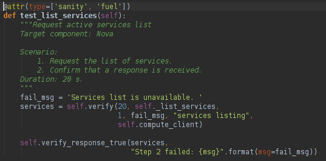
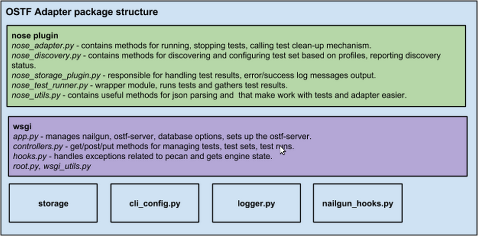

Health Check (OSTF) Contributor's Guide
=======================================

Health Check or OSTF?
Main goal of OSTF
Main rules of code contributions
How to setup my environment?
How should my modules look like?
How to execute my tests?
Now I'm done, what's next?
General OSTF architecture
OSTF packages architecture
OSTF Adapter architecture
Appendix 1

Health Check or OSTF?
^^^^^^^^^^^^^^^^^^^^^
Fuel UI has tab which is called Health Check. In development team though,
there is an established acronym OSTF, which stands for OpenStack Testing Framework.
This is all about the same. For simplicity, this document will use widely
accepted term OSTF.

Main goal of OSTF
^^^^^^^^^^^^^^^^^
After OpenStack installation via Fuel, it`s very important to understand whether it was successful and if it`s ready for work.
OSTF provides a set of health checks - sanity, smoke, HA and additional components tests that check the proper operation of all system components in typical conditions.
There are tests for OpenStack scenarios validation and other specific tests useful in validating an OpenStack deployment.

Main rules of code contributions
^^^^^^^^^^^^^^^^^^^^^^^^^^^^^^^^
There are a few rules you need to follow to successfully pass the code review and contribute high-quality code.

How to setup my environment?
----------------------------

OSTF repository is located at git.openstack.org or GitHub mirror: https://github.com/openstack/fuel-ostf. You also have to install and hook-up gerrit, because otherwise you will not be able to contribute code. To do that you need to follow registration and installation instructions in the document https://wiki.openstack.org/wiki/CLA#Contributors_License_Agreement
After you've completed the instructions, you're all set to begin editing/creating code.

How should my modules look like?
--------------------------------

The rules are quite simple:
  - follow Python coding rules
  - follow OpenStack contributor's rules
  - watch out for mistakes in docstrings
  - follow correct test structure
  - always execute your tests after you wrote them before sending them to review

Speaking of following Python coding standards, you can find the style guide here: http://www.python.org/dev/peps/pep-0008/. You should read it carefully once and after implementing scripts you need to run some checks that will ensure that your code corresponds the standards. Without correcting issues with coding stadards your scripts will not be merged to master.

You should always follow the following implementation rules:
  - name the test module, test class and test method beginning with the word "test"
  - if you have some tests that should be ran in a specific order, add a number to test method name, for example: test_001_create_keypair
  - use verify(), verify_response_body_content() and other methods from mixins (see OSTF package architecture fuel_health/common/test_mixins.py section) with giving them failed step parameter
  - always list all steps you are checking using test_mixins methods in the docstring in Scenario section in correct order
  - always use verify() method when you want to check an operation that can go to an infinite loop

The test docstrings are another important piece and you should always stick to the following docstring structure:
  - test title - test description that will be always shown on UI (the remaining part of docstring will only be shown in cases when test failed)
  - target component (optional) - component name that is tested (e.g. Nova, Keystone)
  - blank line
  - test scenario, example::

       Scenario:
          1. Create a new small-size volume.
          2. Wait for volume status to become "available".
          3. Check volume has correct name.
          4. Create new instance.
          5. Wait for "Active" status.
          6. Attach volume to an instance.
          7. Check volume status is "in use".
          8. Get information on the created volume by its id.
          9. Detach volume from the instance.
          10. Check volume has "available" status.
          11. Delete volume.

  - test duration - an estimate of how much a test will take

deployment tags (optional) - gives information about what kind of environment the test will be run, possible values are CENTOS, Ubuntu, RHEL nova_network, Heat, Sahara)

Here's a test example which confirms the above explanations:

Test run ordering and profiles
------------------------------

Each test set (sanity, smoke, HA and platform_tests) contains a special
variable in __init__.py module which is called __profile__.
The profile variable makes it possible to set different rules, such as test run
order, set up deployment tags, information gathering on cleanup and expected
time estimate for running a test set.

If you are to develop a new set of tests, you need to create __init__.py module
and place __profile__ dict in it. It is important that your profile matches
the following structure::

    __profile__ = {
        "test_runs_ordering_priority": 4,
        "id": "platform_tests",
        "driver": "nose",
        "test_path": "fuel_health/tests/platform_tests",
        "description": ("Platform services functional tests."
                        " Duration 3 min - 60 min"),
        "cleanup_path": "fuel_health.cleanup",
        "deployment_tags": ['additional_components'],
        "exclusive_testsets": [],
        "available_since_release": "2015.2-6.1",
        }

Take note of each field in the profile, along with acceptable values.

  - test_runs_ordering_priority is a field responsible for setting the priority
    in which the test set will be displayed. For example, if you set "6" for
    sanity tests and "3" for smoke tests, smoke test set will be displayed
    first on the HealthCheck tab;
  - id is just the unique id of a test set;
  - driver field is used for setting the test runner;
  - test_path is the field representing path where test set is located starting
    from fuel_health directory;
  - description is the field which contains the value to be shown on the UI
    as the tests duration;
  - cleanup_path is the field that specifies path to module responsible for
    cleanup mechanism (if you do not specify this value, cleanup will not be
    started after your test set);
  - deployment_tags field is used for defining when these tests should be
    available depending on cluster settings;
  - exclusive_testsets field gives you an opportunity to specify test sets that
    will be run successively. For example, you can specify "smoke_sanity" for
    smoke and sanity test set profiles, then these tests will be run not
    simultaneously, but successively.
  - available_since_release field is responsible for the release version
    starting from which a particular test set can be run. This means that
    the test will run only on the specified or newer version of Fuel.

It is necessary to specify a value for each of the attributes. The optional
attribute is "deployment_tags", meaning optionally you may not specify it
in your profile at all. You can leave the "exclusive_testsets" empty ([]) to
run your testset simultaneously with other ones.

How to execute my tests?
------------------------

Simplest way is to install Fuel, and OSTF will be installed as part of it.
  - install virtualbox
  - build Fuel ISO: :ref:`building-fuel-iso`
  - use `virtualbox scripts to run an ISO <https://github.com/openstack/fuel-main/tree/master/virtualbox>`_
  - once the installation is finished, go to Fuel UI (usually it's 10.20.0.2:8000) and create a new cluster with necessary configuration
  - execute::

      rsync -avz <path to fuel_health>/ root@10.20.0.2:/opt/fuel_plugins/ostf/lib/python2.6/site-packages/fuel_health/
  - execute::

      ssh root@10.20.0.2
      ps uax | grep supervisor
      kill <supervisord process number>
      service supervisord start
  - go to Fuel UI and run your new tests

Now I'm done, what's next?
--------------------------

  - don't forget to run pep8 on modified part of code
  - commit your changes
  - execute git review
  - ask to review in IRC

From this part you'll only need to fix and commit review comments (if there are any) by doing the same steps. If there are no review comments left, the reviewers will accept your code and it will be automatically merged to master.

General OSTF architecture
^^^^^^^^^^^^^^^^^^^^^^^^^

Tests are included to Fuel, so they will be accessible as soon as you install Fuel on your lab. OSTF architecture is quite simple, it consists of two main packages:
  - fuel_health which contains the test set itself and related modules
  - fuel_plugin which contains OSTF-adapter that forms necessary test list in context of cluster deployment options and transfers them to UI using REST_API

On the other hand, there is some information necessary for test execution itself. There are several modules that gather information and parse them into objects which will be used in the tests themselves. All information is gathered from Nailgun component.

OSTF REST api interface
-----------------------

Fuel OSTF module provides not only testing, but also RESTful
interface, a means for interaction with the components.

In terms of REST, all types of OSTF entities are managed by three HTTP verbs:
GET, POST and PUT.

The following basic URL is used to make requests to OSTF::

    {ostf_host}:{ostf_port}/v1/{requested_entity}/{cluster_id}

Currently, you can get information about testsets, tests and testruns
via GET request on corresponding URLs for ostf_plugin.

To get information about testsets, make the following GET request on::

    {ostf_host}:{ostf_port}/v1/testsets/{cluster_id}

To get information about tests, make GET request on::

    {ostf_host}:{ostf_port}/v1/tests/{cluster_id}

To get information about executed tests, make the following GET
requests:

- for the whole set of testruns::

    {ostf_host}:{ostf_port}/v1/testruns/

- for the particular testrun::

    {ostf_host}:{ostf_port}/v1/testruns/{testrun_id}

- for the list of testruns executed on the particular cluster::

    {ostf_host}:{ostf_port}/v1/testruns/last/{cluster_id}

To start test execution, make the following POST request on this URL::

    {ostf_host}:{ostf_port}/v1/testruns/

The body must consist of JSON data structure with testsets and the list
of tests belonging to it that must be executed. It should also have
metadata with the information about the cluster
(the key with the "cluster_id" name is used to store the parameter's value)::

    [
        {
            "testset": "test_set_name",
            "tests": ["module.path.to.test.1", ..., "module.path.to.test.n"],
            "metadata": {"cluster_id": id}
        },

        ...,

        {...}, # info for another testrun
        {...},

        ...,

        {...}
    ]

If succeeded, OSTF adapter returns attributes of created testrun entities
in JSON format. If you want to launch only one test, put its id
into the list. To launch all tests, leave the list empty (by default).
Example of the response::

    [
        {
            "status": "running",
            "testset": "sanity",
            "meta": null,
            "ended_at": "2014-12-12 15:31:54.528773",
            "started_at": "2014-12-12 15:31:41.481071",
            "cluster_id": 1,
            "id": 1,
            "tests": [.....info on tests.....]
        },

        ....
    ]

You can also stop and restart testruns. To do that, make a PUT request on
testruns. The request body must contain the list of the testruns and
tests to be stopped or restarted. Example::

        [
            {
                "id": test_run_id,
                "status": ("stopped" | "restarted"),
                "tests": ["module.path.to.test.1", ..., "module.path.to.test.n"]
            },

            ...,

            {...}, # info for another testrun
            {...},

            ...,

            {...}
        ]

If succeeded, OSTF adapter returns attributes of the processed testruns
in JSON format. Its structure is the same as for POST request, described
above.

OSTF package architecture
^^^^^^^^^^^^^^^^^^^^^^^^^

The main modules used in fuel_health package are:

  **config** module is responsible of getting data which is necessary for tests. All data is gathered from Nailgun component or a text config.
   Nailgun provides us with the following data:
    - OpenStack admin user name
    - OpenStack admin user password
    - OpenStack admin user tenant
    - ip of controllers node
    - ip of compute node - easily get data from nailgun by parsing role key in response json
    - deployment mode (HA /non-HA)
    - deployment os (RHEL/CENTOS)
    - keystone / horizon urls
    - tiny proxy address

All other information we need is stored in config.py itself and remains default in this case. In case you are using data from Nailgun (OpenStack installation using Fuel) you should to the following:
initialize NailgunConfig() class.

Nailgun is running on Fuel master node, so you can easily get data for each cluster by invoking curl http:/localhost:8000/api/<uri_here>. Cluster id can be get from OS environment (provided by Fuel)

If you want run OSTF for non Fuel installation, change the initialization of NailgunConfig() to FileConfig() and set parameters marked with green color in config - see Appendix 1 (default config file path fuel_health/etc/test.conf)

  **cleanup.py**  -  invoked by OSTF adapter in case if user stops test execution in Web UI. This module is responsible for deleting all test resources created during test suite run. It simply finds all resources whose name starts with ‘ost1_test-’ and destroys each of them using _delete_it method.

     *Important: if you decide to add additional cleanup for this resource, you have to keep in mind:
     All resources depend on each other, that's why deleting a resource that is still in use will give you an exception;
     Don't forget that deleting several resources requires an ID for each resource, but not its name. You'll need to specify delete_type optional argument in _delete_it method to ‘id’*

  **nmanager.py** contains base classes for tests. Each base class contains setup, teardown and methods that act as an interlayer between tests and OpenStack python clients (see nmanager architecture diagram).

   .. image:: _images/nmanager.png

  **fuel_health/common/test_mixins.py** - provides mixins to pack response verification into a human-readable message. For assertion failure cases, the method requires a step on which we failed and a descriptive
  message to be provided. The verify() method also requires a timeout value to be set. This method should be used when checking OpenStack operations (such as instance creation). Sometimes a cluster
  operation taking too long may be a sign of a problem, so this will secure the tests from such a situation or even from going into infinite loop.

  **fuel_health/common/ssh.py** - provides an easy way to ssh to nodes or instances. This module uses the paramiko library and contains some useful wrappers that make some routine tasks for you
  (such as ssh key authentication, starting transport threads, etc). Also, it contains a rather useful method exec_command_on_vm(), which makes an ssh to an instance through a controller and then executes
  the necessary command on it.

OSTF Adapter architecture
^^^^^^^^^^^^^^^^^^^^^^^^^

The important thing to remember about OSTF Adapter is that just like when writing tests, all code should follow pep8 standard.

Appendix 1
----------

::

    IdentityGroup = [
        cfg.StrOpt('catalog_type',
            default='identity', may be changes on keystone
            help="Catalog type of the Identity service."),
        cfg.BoolOpt('disable_ssl_certificate_validation',
            default=False,
            help="Set to True if using self-signed SSL certificates."),
        cfg.StrOpt('uri',
            default='http://localhost/' (If you are using FileConfig set  here appropriate address)
            help="Full URI of the OpenStack Identity API (Keystone), v2"),
        cfg.StrOpt('url',
            default='http://localhost:5000/v2.0/', (If you are using FileConfig set  here appropriate address to horizon)
            help="Dashboard Openstack url, v2"),
        cfg.StrOpt('uri_v3',
            help='Full URI of the OpenStack Identity API (Keystone), v3'),
        cfg.StrOpt('strategy',
            default='keystone',
            help="Which auth method does the environment use? "
                 "(basic|keystone)"),
        cfg.StrOpt('region',
            default='RegionOne',
            help="The identity region name to use."),
        cfg.StrOpt('admin_username',
            default='nova' , (If you are using FileConfig set appropriate value here)
            help="Administrative Username to use for"
                 "Keystone API requests."),
        cfg.StrOpt('admin_tenant_name', (If you are using FileConfig set appropriate value here)
            default='service',
            help="Administrative Tenant name to use for Keystone API "
                 "requests."),
        cfg.StrOpt('admin_password', (If you are using FileConfig set appropriate value here)
            default='nova',
            help="API key to use when authenticating as admin.",
            secret=True),
        ]

    ComputeGroup = [
        cfg.BoolOpt('allow_tenant_isolation',
            default=False,
            help="Allows test cases to create/destroy tenants and "
                 "users. This option enables isolated test cases and "
                 "better parallel execution, but also requires that "
                 "OpenStack Identity API admin credentials are known."),
        cfg.BoolOpt('allow_tenant_reuse',
            default=True,
            help="If allow_tenant_isolation is True and a tenant that "
                 "would be created for a given test already exists (such "
                 "as from a previously-failed run), re-use that tenant "
                 "instead of failing because of the conflict. Note that "
                 "this would result in the tenant being deleted at the "
                 "end of a subsequent successful run."),
        cfg.StrOpt('image_ssh_user',
            default="root", (If you are using FileConfig set appropriate value here)
            help="User name used to authenticate to an instance."),
        cfg.StrOpt('image_alt_ssh_user',
            default="root", (If you are using FileConfig set appropriate value here)
            help="User name used to authenticate to an instance using "
                 "the alternate image."),
        cfg.BoolOpt('create_image_enabled',
            default=True,
            help="Does the test environment support snapshots?"),
        cfg.IntOpt('build_interval',
            default=10,
            help="Time in seconds between build status checks."),
        cfg.IntOpt('build_timeout',
            default=160,
            help="Timeout in seconds to wait for an instance to build."),
        cfg.BoolOpt('run_ssh',
            default=False,
            help="Does the test environment support snapshots?"),
        cfg.StrOpt('ssh_user',
            default='root', (If you are using FileConfig set appropriate value here)
            help="User name used to authenticate to an instance."),
        cfg.IntOpt('ssh_timeout',
            default=50,
            help="Timeout in seconds to wait for authentication to "
                 "succeed."),
        cfg.IntOpt('ssh_channel_timeout',
            default=20,
            help="Timeout in seconds to wait for output from ssh "
                 "channel."),
        cfg.IntOpt('ip_version_for_ssh',
            default=4,
            help="IP version used for SSH connections."),
        cfg.StrOpt('catalog_type',
            default='compute',
            help="Catalog type of the Compute service."),
        cfg.StrOpt('path_to_private_key',
            default='/root/.ssh/id_rsa', (If you are using FileConfig set appropriate value here)
            help="Path to a private key file for SSH access to remote "
                 "hosts"),
        cfg.ListOpt('controller_nodes',
            default=[], (If you are using FileConfig set appropriate value here)
            help="IP addresses of controller nodes"),
        cfg.ListOpt('compute_nodes',
            default=[], (If you are using FileConfig set appropriate value here)
            help="IP addresses of compute nodes"),
        cfg.StrOpt('controller_node_ssh_user',
            default='root', (If you are using FileConfig set appropriate value here)
            help="ssh user of one of the controller nodes"),
        cfg.StrOpt('controller_node_ssh_password',
            default='r00tme', (If you are using FileConfig set appropriate value here)
            help="ssh user pass of one of the controller nodes"),
        cfg.StrOpt('image_name',
            default="TestVM", (If you are using FileConfig set appropriate value here)
            help="Valid secondary image reference to be used in tests."),
        cfg.StrOpt('deployment_mode',
            default="ha", (If you are using FileConfig set appropriate value here)
            help="Deployments mode"),
        cfg.StrOpt('deployment_os',
            default="RHEL", (If you are using FileConfig set appropriate value here)
            help="Deployments os"),
        cfg.IntOpt('flavor_ref',
            default=42,
            help="Valid primary flavor to use in tests."),
    ]

    ImageGroup = [
        cfg.StrOpt('api_version',
            default='1',
            help="Version of the API"),
        cfg.StrOpt('catalog_type',
            default='image',
            help='Catalog type of the Image service.'),
        cfg.StrOpt('http_image',
            default='http://download.cirros-cloud.net/0.3.1/'
                    'cirros-0.3.1-x86_64-uec.tar.gz',
            help='http accessable image')
    ]

    NetworkGroup = [
        cfg.StrOpt('catalog_type',
            default='network',
            help='Catalog type of the Network service.'),
        cfg.StrOpt('tenant_network_cidr',
            default="10.100.0.0/16",
            help="The cidr block to allocate tenant networks from"),
        cfg.IntOpt('tenant_network_mask_bits',
            default=29,
            help="The mask bits for tenant networks"),
        cfg.BoolOpt('tenant_networks_reachable',
            default=True,
            help="Whether tenant network connectivity should be "
                 "evaluated directly"),
        cfg.BoolOpt('neutron_available',
            default=False,
            help="Whether or not neutron is expected to be available"),
    ]

    VolumeGroup = [
        cfg.IntOpt('build_interval',
            default=10,
            help='Time in seconds between volume availability checks.'),
        cfg.IntOpt('build_timeout',
            default=180,
            help='Timeout in seconds to wait for a volume to become'
                 'available.'),
        cfg.StrOpt('catalog_type',
            default='volume',
            help="Catalog type of the Volume Service"),
        cfg.BoolOpt('cinder_node_exist',
            default=True,
            help="Allow to run tests if cinder exist"),
        cfg.BoolOpt('multi_backend_enabled',
            default=False,
            help="Runs Cinder multi-backend test (requires 2 backends)"),
        cfg.StrOpt('backend1_name',
            default='BACKEND_1',
            help="Name of the backend1 (must be declared in cinder.conf)"),
        cfg.StrOpt('backend2_name',
            default='BACKEND_2',
            help="Name of the backend2 (must be declared in cinder.conf)"),
    ]

    ObjectStoreConfig = [
        cfg.StrOpt('catalog_type',
            default='object-store',
            help="Catalog type of the Object-Storage service."),
        cfg.StrOpt('container_sync_timeout',
            default=120,
            help="Number of seconds to time on waiting for a container"
                 "to container synchronization complete."),
        cfg.StrOpt('container_sync_interval',
            default=5,
            help="Number of seconds to wait while looping to check the"
                 "status of a container to container synchronization"),
    ]

